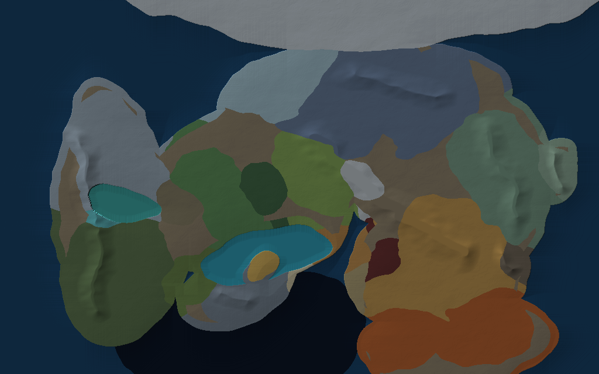

# Priestess

A Minecraft Forge mod (MC 1.20.1 / Forge 47.4.10) adding **Terra** — a standalone
Overworld-like dimension with 15 custom biomes across a hand-authored map of Terra, and
jigsaw structures.

| | |
|---|---|
| Mod ID | `priestess` |
| Dimension | `priestess:terra` |
| Base package | `com.jyhrie.priestess` |
| Getting in | `/execute in priestess:terra run tp @s ~ ~ ~` — there is no portal yet |

---

## The one thing to understand first

**Almost nothing in this mod is registered at runtime.** The dimension, biomes,
noise settings and structures are *datapack JSON* that gets generated from the Java
in `world/dimension/` by a build task:

```
edit Java in world/dimension/  ──►  ./gradlew runData  ──►  src/generated/resources/**.json  ──►  loaded by the game
```

So the workflow for any worldgen change is:

1. Edit the Java.
2. Run `./gradlew runData`.
3. *Then* run `./gradlew runClient`.

If you skip step 2, the game loads the **old** JSON and your change silently does nothing.

Two rules that follow from this:

- **Never hand-edit anything under `src/generated/resources/`.** `runData` overwrites it.
- **Worldgen changes need a fresh world.** Already-generated chunks keep their old
  terrain and biomes forever. Delete the test world in `run/saves/` and make a new one.

Only items, blocks and the creative tab are registered in code at runtime (via
`DeferredRegister` in `Priestess.java`).

---

## Project layout

```
src/main/java/com/jyhrie/priestess/
├── Priestess.java                  main mod class, MOD_ID, runtime registration
├── block/ModBlocks.java            block registry (auto-registers BlockItems too)
├── item/
│   ├── ModItems.java               item registry
│   └── ModCreativeTabs.java        the "Priestess" creative tab
├── damage/ModDamageTypes.java      damage types (datapack JSON, like worldgen)
├── entity/                         ← the Columbia roster
│   ├── ModEntities.java            entity types, attributes, spawn placements
│   ├── OriginiumSlug.java          the wastes: eats machine power, bursts when killed
│   ├── ImprisonedShadow.java       Jesselton's phase-two adds
│   ├── bosses/
│   │   ├── JesseltonWilliams.java  Mansfield boss — two phases, drops the Master Key
│   │   └── Awaken.java             Dorothy's boss — GeckoLib model, no behaviour yet
│   ├── RoguePowerArmour.java       Rhine Lab: halves kinetic damage
│   ├── RhineSecurityDrone.java     Rhine Lab: flying, strips armour durability
│   ├── ArtsBeam.java               the shared hitscan attack
│   └── Machines.java               finds/drains Forge-Energy blocks, mod-agnostically
├── client/                         ← client only; models and renderers
│   ├── PriestessClient.java        renderer + layer bindings
│   ├── PriestessModelLayers.java   geometry for the two hand-built non-humanoid mobs
│   ├── PriestessEntityModel.java   the shared placeholder model
│   ├── PriestessMobRenderer.java   one renderer for the five non-GeckoLib mobs
│   └── AwakenRenderer.java         GeckoLib renderer for "Awaken"
├── oripathy/                       ← the infection
│   ├── Oripathy.java               the value, its thresholds, the capability
│   ├── OripathyProvider.java       attaches it to a Player, saves it to NBT
│   ├── OripathyEvents.java         symptoms, carrying it through death
│   └── OripathyCommand.java        /oripathy get|set|add
├── datagen/                        ← turns the Java below into JSON
│   ├── DataGenerators.java         wires up every provider
│   ├── ModBlockStateProvider.java  blockstates + block models
│   ├── ModItemModelProvider.java   item models
│   ├── ModLanguageProvider.java    en_us.json
│   ├── ModLootTableProvider.java   block drops
│   └── ModWorldGenProvider.java    registry bootstrap order for all worldgen
├── world/dimension/
│   ├── ModDimensions.java          dimension type + chunk generator wiring
│   ├── ModBiomes.java              biome definitions (colors, temperature, mobs)
│   ├── ModNoiseSettings.java       terrain shape + surface blocks
│   ├── ModStructures.java          structure declarations
│   ├── ModStructurePlacements.java the one placement type this mod adds
│   └── SingleInRegionStructurePlacement.java  one per world, anywhere in a region
└── world/terra/                    ← the map: where everything actually is
    ├── TerraRegion.java            every region, its map colour, its 8 biomes
    ├── TerraSlot.java              the 8 terrain classes and their elevations
    ├── TerraMap.java               loads the PNGs, warps and samples them
    ├── TerraMapBiomeSource.java    the BiomeSource that reads the map
    ├── TerraElevationFunction.java exposes map elevation to the terrain splines
    ├── TerraReliefFunction.java    exposes map relief to the terrain splines
    ├── TerraMapPreview.java        renders docs/terra_world_preview.png
    └── TerraAnchors.java           picks a spot in a region for a one-per-world structure

src/main/resources/                 ← hand-authored assets (safe to edit)
├── assets/priestess/textures/block/*.png
├── data/priestess/structures/*.nbt
└── data/priestess/terra/
    ├── regions.png                 ← THE MAP. one flat colour per region
    ├── elevation.png               ← greyscale height, 0 = abyss, 255 = peak
    └── relief.png                  ← greyscale ruggedness, 0 = flat, 255 = crag

tools/generate_terra_map.py         regenerates regions + elevation from a layout
tools/generate_relief_map.py        first draft of relief.png, from regions.png
tools/generate_placeholder_art.py   placeholder mob + item textures
tools/generate_placeholder_dungeons.py  the three dungeon .nbt files
docs/terra_map_preview.png          shaded political map, for humans
docs/terra_world_preview.png        what the generator will actually produce

src/generated/resources/            ← GENERATED, do not edit
```

---

## Adding an item

1. **Register it** in `item/ModItems.java`:

   ```java
   public static final RegistryObject<Item> JOKLUM_CRYSTAL = ITEMS.register("joklum_crystal",
           () -> new Item(new Item.Properties()));
   ```

   (You'll need `import net.minecraftforge.registries.RegistryObject;` back.)

2. **Add the texture** at `src/main/resources/assets/priestess/textures/item/joklum_crystal.png`
   (16×16).

3. **Give it a model** in `datagen/ModItemModelProvider.java`:

   ```java
   basicItem(ModItems.JOKLUM_CRYSTAL.get());
   ```

4. **Name it** in `datagen/ModLanguageProvider.java`:

   ```java
   add(ModItems.JOKLUM_CRYSTAL.get(), "Joklum Crystal");
   ```

5. `./gradlew runData`

It appears in the Priestess creative tab automatically — the tab iterates
`ModItems.ITEMS`, so there is no list to keep in sync.

---

## Adding a block

Blocks are a little more work than items because a block needs a blockstate, a model,
a loot table, and a matching item.

1. **Register it** in `block/ModBlocks.java` using the `registerBlock` helper — it
   registers the `BlockItem` for you:

   ```java
   public static final RegistryObject<Block> KAZDEL_BASALT = registerBlock("kazdel_basalt",
           () -> new Block(BlockBehaviour.Properties.copy(Blocks.BASALT)));
   ```

   `BlockBehaviour.Properties.copy(...)` inherits hardness, tool, sound and blast
   resistance from a vanilla block. Pick a vanilla block that behaves the way you want.

   Use a specific block class when you want vanilla behaviour — e.g. `IBERIAN_SAND` is a
   `SandBlock` so it falls under gravity:

   ```java
   () -> new SandBlock(0xE6C280, BlockBehaviour.Properties.copy(Blocks.SAND))
   //                  ^ dust colour shown when it falls
   ```

2. **Add the texture** at `src/main/resources/assets/priestess/textures/block/kazdel_basalt.png`.

3. **Blockstate + model** in `datagen/ModBlockStateProvider.java`:

   ```java
   simpleBlockWithItem(ModBlocks.KAZDEL_BASALT.get(), cubeAll(ModBlocks.KAZDEL_BASALT.get()));
   ```

   `cubeAll` uses the same texture on all six faces and expects it at the path in step 2.

4. **Loot table** in `datagen/ModLootTableProvider.java` → `BlockLoot.generate()`:

   ```java
   this.dropSelf(ModBlocks.KAZDEL_BASALT.get());
   ```

   **This is not optional.** `getKnownBlocks()` reports every registered block, and
   datagen *fails* if a known block has no loot table. If you get a datagen error
   naming your new block, this is the step you missed.

5. **Name it** in `datagen/ModLanguageProvider.java`:

   ```java
   add(ModBlocks.KAZDEL_BASALT.get(), "Kazdel Basalt");
   ```

6. `./gradlew runData`

To then make terrain actually *use* the block, see
[Surface rules](docs/WORLDGEN.md#surface-rules).

---

## Worldgen

**Terra's geography is a hand-authored map, not climate noise.** Three PNGs in
`src/main/resources/data/priestess/terra/` decide everything: `regions.png` (one flat
colour per region), `elevation.png` (greyscale height) and `relief.png` (greyscale
ruggedness). A custom `BiomeSource` reads the region, elevation picks one of eight terrain
slots, and the pair picks the biome. The same elevation drives the terrain height splines,
which is what keeps beaches at sea level instead of halfway up a mountain.

**Elevation and relief are separate on purpose.** Elevation says how high the ground is;
relief says how much it rises and falls once it gets there. Grey in `relief.png` reads
directly as blocks — 0 is dead flat, 80 is ordinary rolling country at ±15 blocks, 255 is
a broken crag at ±48 — and that is the height of a spur, not its spacing. Relief used to
be derived from elevation, which meant brightening a mountain quietly made it bumpier as
well as taller, and a high plateau or a rugged lowland could not be authored at all.
Relief is damped to zero at the waterline whatever you paint, so coastlines stay clean.



### Scale, origin and height

| | Value | Defined in |
|---|---|---|
| **World width** | 65,536 blocks | `TerraMap.WORLD_WIDTH_BLOCKS` — **the scale knob** |
| **Map resolution** | 4092 × 4092 px | Java reads it from the PNG |
| **Blocks per pixel** | 16 | derived: world width ÷ image width |
| **World size** | 65,536 × 65,536 blocks | derived: height follows the image aspect |
| **X / Z range** | −32,768 → +32,768, both axes | derived |
| **Origin (0, 0)** | **in Columbia** — this is spawn, and where the chapter starts | `ORIGIN_AT_BLOCK_X/Z` |
| **Origin shift** | −10,240, −3,072 | `ORIGIN_AT_BLOCK_X/Z`, `TerraMap.java` — paste a region's coordinates in to spawn there |
| **Mountain spur spacing** | ~128 blocks | `rangeScale`, derived from world width — **not** from blocks/px |
| **Lowest ground** | y 28 | first knot of `mapHeight` |
| **Highest ground** | y 244 base, **y 292 with relief** | last knot of `mapHeight` + `ruggedness` × `reliefVariation` |
| **Sea level** | y 124 | `ModNoiseSettings.java:100` |
| **World floor / ceiling** | y −64 / y 320 | `NoiseSettings.create(-64, 384, …)` |
| **Off the N / S edge** | Infy Icefield / Foehn Hotlands, forever | the map's own top and bottom rows |
| **Off the E / W edge** | open ocean, forever | the map's own left and right columns |
| **Seed-dependent?** | No. Terra is the same in every world. | — |

Grey value in `elevation.png` becomes a world height like this:

```
grey 0-255 ──/255──► elevation 0..1 ──×2−1──► density −1..1 ──mapHeight──► terrainHeight
                                                                                │
                                                     surfaceY = 128 + 128 × terrainHeight
```

So a `mapHeight` knot reads `y = 128 + 128 × value`, and only ~28 blocks of headroom are
left above the tallest peaks. Details and the full "if you want to change X" table are in
[docs/WORLDGEN.md](docs/WORLDGEN.md#scale-origin-and-height).

**→ Full reference: [docs/WORLDGEN.md](docs/WORLDGEN.md)** — how the PNGs are read, the
terrain slot table with the grey values to paint, adding regions and biomes, surface
rules, terrain splines, and troubleshooting.

Quick pointers:

| I want to change… | Edit |
|---|---|
| Where a region physically sits | `data/priestess/terra/regions.png` |
| How high the ground is | `data/priestess/terra/elevation.png` |
| Which biome a region wears at a given height | `world/terra/TerraRegion.java` |
| Sky/fog/water colour, temperature, rain, mob spawns | `world/dimension/ModBiomes.java` |
| Which blocks the ground is made of | `ModNoiseSettings.createSurfaceRules()` |
| How bumpy a place is | `data/priestess/terra/relief.png` — paint it |
| How far apart mountain spurs are | `rangeScale` in `ModNoiseSettings` |
| The whole map layout, from scratch | `tools/generate_terra_map.py` |

> **If terrain comes out as gravel after repainting the map**, check `rangeScale`. Spur
> size is derived from `WORLD_WIDTH_BLOCKS`, *not* from blocks-per-pixel — repainting at a
> finer resolution must not shrink the mountains. It used to key off blocks-per-pixel,
> which turned a 4092px repaint into ridges 16 blocks apart carrying ±28 blocks of relief.

After any worldgen change: `./gradlew runData`, then check
`docs/terra_world_preview.png` and the datagen log — the log prints every region's share
of the world, a teleport coordinate for each, and shouts about any region that came out
unreachable. **Worldgen changes need a fresh world**; delete the test world in
`run/saves/`.

---

## Adding a structure

Structures are declared **once** in the CONFIGURATION BLOCK of `ModStructures.java`. The
three bootstrap methods derive the template pool, the structure and the structure set
from that single declaration, so you never touch them.

1. **Build it in-game** with structure blocks, save it, then copy the `.nbt` from
   `run/saves/<world>/generated/minecraft/structures/` to
   `src/main/resources/data/priestess/structures/my_structure.nbt`.

2. **Declare it** in the static block:

   ```java
   registerStructure(
           "kazdel_spire",                     // structure id -> priestess:kazdel_spire
           List.of("kazdel_spire_a",           // .nbt file names, chosen at random,
                   "kazdel_spire_b"),          //   equal weight
           ModBiomes.KAZDEL_CRAGS,             // biome it spawns in
           24,                                 // spacing: avg chunks between attempts
           8,                                  // separation: min chunks apart (< spacing!)
           78341265,                           // salt: any int, UNIQUE per structure
           UniformHeight.of(VerticalAnchor.absolute(-12), VerticalAnchor.absolute(-4)),
           true                                // project onto the heightmap
   );
   ```

3. `./gradlew runData`

Notes on the fields:

- **`spacing` / `separation`** control density. `separation` **must** be less than
  `spacing` or the game throws on load. Lower spacing = more common. The existing ice
  spike uses `spacing = 1, separation = 0`, which is "attempt in every chunk" — very
  dense, good for scatter decoration, bad for landmarks.
- **`salt`** must be unique across structures. Two structures sharing a salt will try to
  generate at exactly the same chunk coordinates.
- **`heightProvider`** is the vertical offset applied *relative to* the heightmap when
  `projectToHeightmap` is true. The ice spike's `-12 … -4` sinks it into the ground so
  its base isn't left floating.
- **NBT naming**: the entry `"kazdel_spire_a"` resolves to
  `data/priestess/structures/kazdel_spire_a.nbt`. A typo here produces a missing-template
  error at worldgen time, not at datagen time.
- The structure targets exactly one biome. For several biomes, change
  `HolderSet.direct(biomes.getOrThrow(data.targetBiome()))` in `bootstrapStructures` to
  take a list.

### One per world

A landmark that gates progression cannot use `registerScattered` — a spacing is "one per
*area*", never "one, ever", and two Mansfield State Prisons means two Master Keys. Use
`registerUnique` instead, which names a **region** rather than a spacing:

```java
registerUnique(
        "mansfield_state_prison",
        List.of("mansfield_state_prison"),
        ModBiomes.COLUMBIA,          // biome it must land in — checked when the chunk generates
        TerraRegion.COLUMBIA,        // region the spot is drawn from
        UniformHeight.of(VerticalAnchor.absolute(-2), VerticalAnchor.absolute(-1)),
        true
);
```

There is no coordinate here and none in the generated JSON either. The JSON names the
region; `TerraAnchors` scans the map for land well inside it and picks a spot **from the
world seed** when the world is created. So it is one per world, anywhere in that biome, and
somewhere different in every save.

Two notes:

- **The coordinates are only in the server log.** `/locate` searches about a hundred chunks
  and these can be thousands away. `TerraAnchors` logs its picks at world creation —
  `Terra anchors in COLUMBIA for seed …` — and that is the only place they exist.
- **Declaration order picks who goes where.** Several unique structures in one region are
  dealt positions in the order declared, at least 1024 blocks apart. Re-ordering the
  configuration block reshuffles them within an existing seed.

---

## The Columbia chapter

The first chapter of progression: land in Columbia, survive the wastes, clear three
dungeons, come away with the blueprint that unlocks Originium refining. Spawn is in Columbia
because `ORIGIN_AT_BLOCK` puts it there.

**Everything below is a placeholder.** The mobs are cubes and flat-coloured zombies, and the
dungeons are generated from a Python script rather than built. They exist so the chapter can
be walked end to end and the pacing judged, which is the only question a placeholder answers.
Both generators are idempotent and seeded — re-run them and nothing changes; overwrite an
output with real art or a real build and delete its entry from the script.

| Mob | Where | What it does |
|---|---|---|
| **Originium Slug** | the open wastes (the only natural spawn) | Drains stored energy out of any block exposing Forge's energy capability, so it works against any tech mod and none. Bursts on death: corrodes anything nearby, drains machines, and infects you with Oripathy. |
| **Jesselton Williams** | Mansfield State Prison | Boss. Phase one is heavy kinetic Arts that armour answers; below half health he switches to `priestess:void_arts`, which is in `bypasses_armor`, and starts summoning adds. Drops the **Mansfield Master Key**. |
| **Imprisoned Shadow** | Mansfield | Jesselton's adds. Fast, frail, knockback-immune, and every one fades after a minute so a long fight cannot silt up. |
| **Awaken** | Dorothy's Vision | Boss. Summoned by Dorothy's Terminal. Cannot move, cannot be pushed, and has **no attacks yet** — a 6.75-block GeckoLib silhouette with a health bar and nothing behind it. |
| **Rogue Columbian Power Armour** | Rhine Lab HQ | Halves kinetic damage on top of heavy armour; anything that bypasses armour comes through whole. |
| **Rhine Security Drone** | Rhine Lab HQ | Flies. Its beam does almost no damage and a great deal of armour durability — it exists to take the gear the power armour demands. |

**→ How a boss is built: [docs/BOSSES.md](docs/BOSSES.md)** — the shared skeleton, the
hitscan Arts beam, and a full walkthrough of Jesselton Williams.

The three dungeons are `registerUnique`, so there is exactly one of each per world, somewhere
in Columbia. Rhine Lab's Director's Office holds **Blueprint: Originium Refinement** in a
chest; that is a stand-in for rebooting the Archival Mainframe, and the pool to delete when
the mainframe exists.

Test with the spawn eggs — every mob has one, in the Priestess tab:

```
/give @s priestess:jesselton_williams_spawn_egg
/locate structure priestess:mansfield_state_prison    only if you are already near it
```

---

## Oripathy

A per-player infection level, in the spirit of Thaumcraft's warp: a single number that
sits on the player, saves with them, and is **never shown**. There is no HUD and no chat
message — you find out how infected you are by noticing that you have started to limp.

| | |
|---|---|
| Range | **1 – 10000**. Everyone carries a trace; there is no zero. |
| Stored as | a capability on the Player → saves to the player file, survives logout |
| Read/written by | `Oripathy.of(player)`, `Oripathy.set(player, n)`, `Oripathy.add(player, n)`, `Oripathy.infect(player, n)` |
| Clamped | always. `add(-99999)` lands on 1, `set(50000)` lands on 10000. |

### Stages

Symptoms are **cumulative** — each stage keeps what the one below it gave you.

| From | Symptoms |
|---|---|
| 1 | none |
| **5000** | Slowness II |
| **7500** | Slowness II + Weakness II |
| **9000** | Slowness II + Weakness II + Blindness |
| **10000** | **Death** — `priestess:oripathy` damage, "*was crystallised by Oripathy*" |

Creative and spectator players are exempt from all of it.

Effects are *refreshed*, not held: `OripathyEvents` tops them up once a second with a
10-second duration. So they never lapse, they fade within 10 s of a cure, and a stronger
or longer potion the player drank is never overwritten or cut short.

### Death and respawn

Oripathy survives death and dimension changes — `PlayerEvent.Clone` copies it onto the new
player. The one exception is dying *of* it: a player killed at 10000 respawns at
**7000** (`Oripathy.AFTER_DEATH`), limping but able to see and fight. Without that they
would respawn still terminal and die again a second later.

### Raising it — two doors, and the difference matters

| Call | For | Open Wounds applies? |
|---|---|---|
| `Oripathy.infect(player, n)` | a **wound** — a mob, a hit, a block that got into you | **yes** |
| `Oripathy.add(player, n)` | ambient exposure, treatment (negative `n`), the command, the acute drain | no |

Content that infects people should call **`infect`**. `add` is the raw number.
`infect` ignores non-positive amounts — a wound that heals you is not a thing, and a
negative one would be made *worse* by Open Wounds, which is backwards.

The only thing raising oripathy by itself today is ambient exposure: **+1 every 15 seconds
while you are in `priestess:terra`**, and nothing else — no regard for biome, depth, or what
you are wearing. That is a placeholder for the real passive model. It goes in through `add`,
so Open Wounds deliberately does not touch it.

### Effects

Two potion effects, registered in `effect/ModEffects.java` — where both level tables live, so
all the tuning for both is in one file. Neither effect does anything on its own; each is a
number that oripathy code reads. Obtainable only via `/effect give` so far.

**Open Wounds** — every wound drives in a flat bonus more. It does not scale the wound, it
adds to it, and it does not touch anything that came through `add`.

| Level | Bonus per wound |
|---|---|
| I | +15 |
| II | +30 |
| III | +50 |

**Acute Oripathy** — a flare-up. The moment it lands it drives a whole dose in, then hands
**90%** of that dose back over the effect's own duration. The remaining 10% is permanent.

| Level | Dose on landing | Drains back | Keeps forever |
|---|---|---|---|
| I | +250 | 225 | 25 |
| II | +500 | 450 | 50 |
| III | +1000 | 900 | 100 |

So `/effect give @s priestess:acute_oripathy 5 2` is +1000 now and −900 spread over those
5 seconds, ending +100 up. The drain is timed to the effect's duration, so a longer `/effect`
means a slower fall, and the icon disappearing and the number settling happen together.

Notes on the two of them together:

- The dose is a **wound**, so Open Wounds adds its bonus on top — but only the dose is
  refunded. Open Wounds III + Acute Oripathy III is +1050 now and **+150 forever**: it makes
  the residue bigger, not the peak.
- Only a **new** flare-up doses you. Re-applying at the same level, or a weaker one under a
  stronger one, just refreshes the timer. Without that, anything reapplying the effect each
  tick would pour in twenty doses a second.
- The drain is *scheduled state*, not a property of the effect: it is stored on the capability
  and saved to NBT, so drinking milk or logging out mid-flare-up still gets you the refund.
  Milk clears the icon, it does not make the dose permanent.
- **Death writes off whatever the flare-up still owed.** You died of the disease; the refund
  is meaningless next to that.
- Levels above III are treated as III rather than extrapolated.

### Command

Op-only (permission level 2) — it is an admin and testing tool, not something a survival
player is meant to consult.

```
/oripathy get [target]            defaults to yourself; also prints the stage name
/oripathy set <targets> <value>   1..10000
/oripathy add <targets> <amount>  negative to treat; result is clamped
```

`get` also reports how much a flare-up still has to drain off, when there is one — otherwise
Acute Oripathy is completely invisible and there is no way to tell it is working.

---

## Testing

```bash
./gradlew runData      # regenerate JSON  — after ANY worldgen change
./gradlew runClient    # launch the game
```

Useful in-game commands (creative + cheats):

```
/execute in priestess:terra run tp @s ~ ~ ~     enter the dimension
/execute in minecraft:overworld run tp @s ~ ~ ~ leave it
/locate biome priestess:infy_icefields          find a biome
/place structure priestess:infy_ice_spike       force-place a structure here
```

Oripathy is invisible, so watch it with `/oripathy get` before and after. Note that creative
and spectator are exempt from ambient gain and from symptoms — **switch to survival** or you
will conclude nothing works:

```
/gamemode survival
/oripathy set @s 1
/effect give @s priestess:open_wounds 60 2      Open Wounds III for a minute
/effect give @s priestess:acute_oripathy 5 2    +1000, then -900 over those 5 s
/oripathy get                                   spam it and watch the number fall
```

If a change doesn't show up, check in this order:

1. Did you run `runData`? Look at the file under `src/generated/resources/` and confirm
   your change is in the JSON.
2. Are you in a **new** world? Old chunks never regenerate.
3. For structures, is the `.nbt` filename exactly right?

## Build

```bash
./gradlew build        # -> build/libs/priestess-1.0.0.jar
```

Mod metadata (id, name, version, description) lives in `gradle.properties`;
`mods.toml` reads it via `${...}` substitution, so edit `gradle.properties`, not
`mods.toml`.
